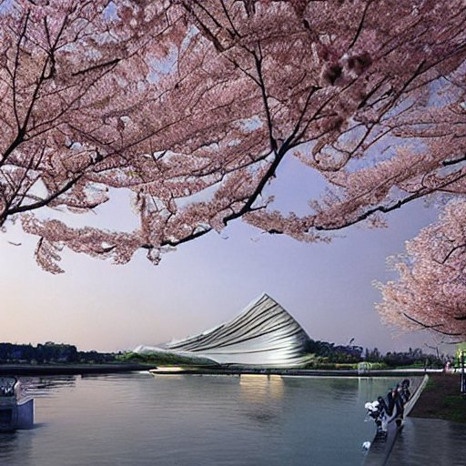
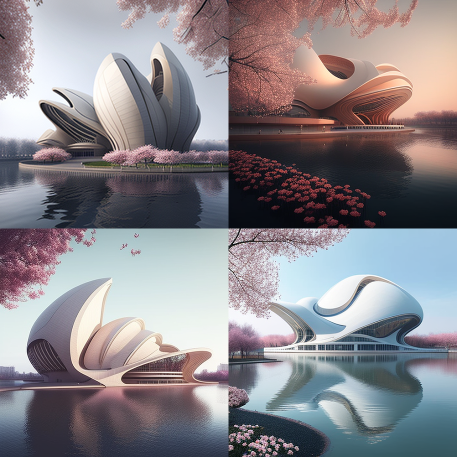

# AI-in-Architecture
# Stable Diffusion & Midjourney
提示句子：Next to the Xiangjiang River, where the cherry blossoms bloom, there is a large theater in the style of Zaha Hadid
Stable Diffusion生成结果（约10秒）：
Midjourney生成结果（约40秒）：
提示句子：Next to the Xiangjiang River, where the cherry blossoms bloom, there is a large **house** in the style of Zaha Hadid
Stable Diffusion生成结果（约10秒）：
Midjourney生成结果（约40秒）
Midjourney生成结果2（约40秒）

Disco Diffusion
(绘制人物表现不是很好，出图曼、参数多)
Stable Diffusion出图速度快、可以商业化使用。可以使用网页版，但是似乎有次数限制，部署到本地就能无限使用
网页版本：https://beta.dreamstudio.ai/(可以使用谷歌账号或者discord账户登录)，每个人注册就有100个积分，大约可以生成中等质量的图片100张，当然，也可以购买，10刀1000积分。

