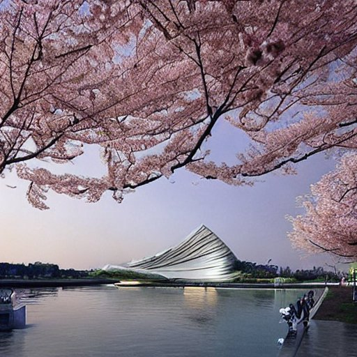
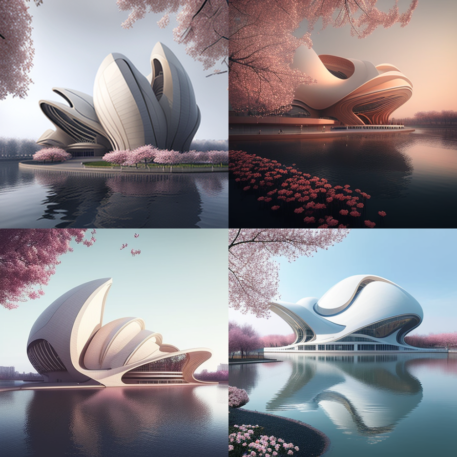
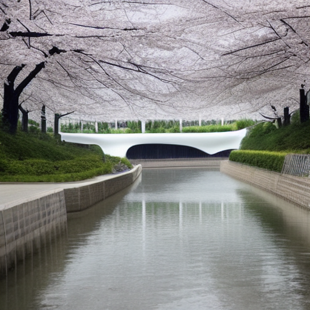
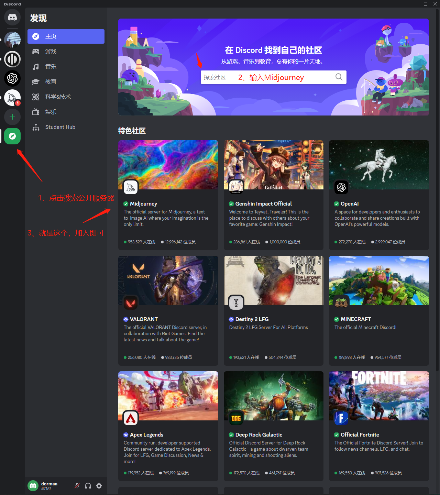
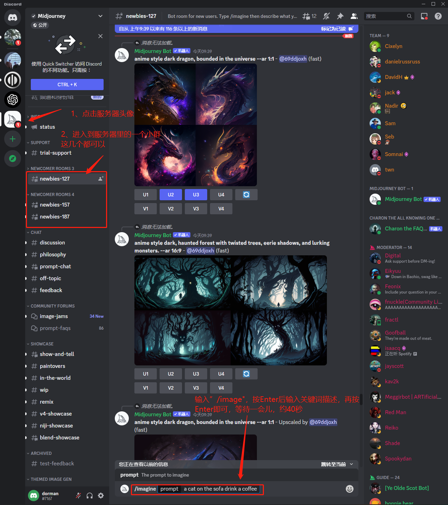
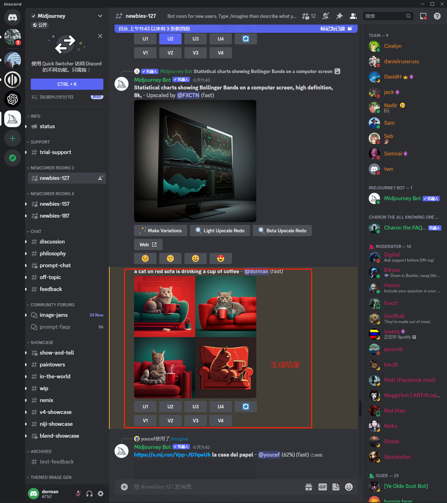
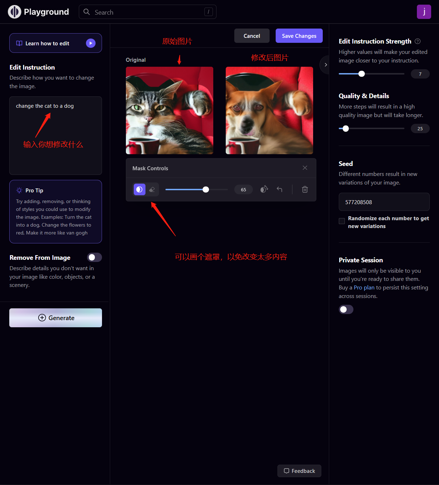
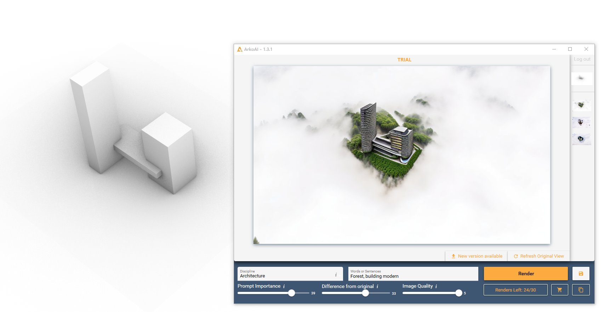

# 文字生成图片工具
## 1. 生成效果
这里比较三个，分别是Stable Diffusion & Midjourney & Playground
提示句子：Next to the Xiangjiang River, where the cherry blossoms bloom, there is a large theater in the style of Zaha Hadid
Stable Diffusion生成结果（约10秒）：
Midjourney生成结果（约40秒）：
Playground生成结果（约10秒）：

## 2. 使用教程
1. Stable Diffusion可以在网页上也可以在本地部署，网页端点击[这里](https://beta.dreamstudio.ai/)，进入后利用谷歌账号或者discord账号注册登录即可。

2. Midjourney可以在discord里使用，下载discord后直接关注。

3. Playground就是一个网页，点击[这里](https://playgroundai.com/)，可以直接利用文字生成图片，只是多了一个后期修改的功能，比如，我们生成了坐在红色沙发上喝咖啡的猫图片之后，可以把猫变成狗，当然，我们也可以直接上传本地图片进行生成。

## 3. 总结
1. Stable Diffusion出图速度快、可以商业化使用。可以使用网页版，但是似乎有次数限制，部署到本地就能无限使用
网页版本：(可以使用谷歌账号或者discord账户登录)，每个人注册就有100个积分，大约可以生成中等质量的图片100张，当然，也可以购买，10刀1000积分。
1. Midjourney生成效果比较好，但是内核还是Stable Diffusion
2. Playground相较于前两者，可以对生成后的图片或者本地图片进行二次编辑。

结论：这三个工具在建筑设计的方案阶段可以给大家提供很多灵感，特别是playground的可编辑性有较大的应用空间。
不足：如果设计师在前期有个大概的想法，已经绘制出来的建筑轮廓，是否能让AI在轮廓的基础上进行进一步的深化，出几个不同的效果图看看？

# 模型生成效果图工具：ArkoAI
## 1. 安装方式：直接在Rhino里搜索安装

## 2. 使用方式如图

